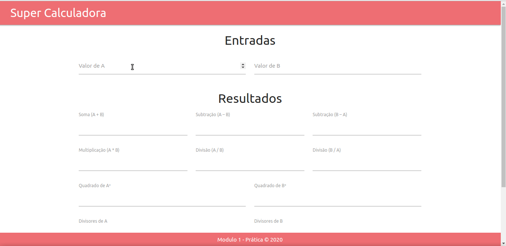
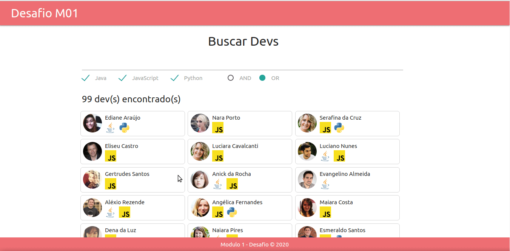

# BOOTCAMP FRONT END IGTI

Nesse repositorio se encontra os projetos desenvolvidos durante o [Bootcamp Desenvolvedor Front-End](https://www.igti.com.br/custom/desenvolvedor-front-end/) pelo IGTI. Os mesmos foram separados por módulos e dentro de cada módulo existem as práticas das aulas, e os desafios do módulo.

# Apresentação das aplicações

- Super Calculadora
  - _Inserir Descrição_
- Desafio Modulo 1 (Buscar Devs)
  - _Inserir Descrição_
- Lista de Países e favoritos
  - _Inserir Descrição_

## Preview Super Calculadora

## Preview Buscar Devs

## Preview Lista de Países e Favoritos

